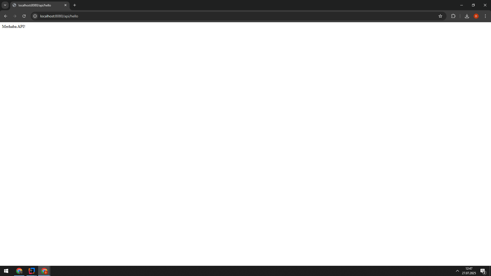
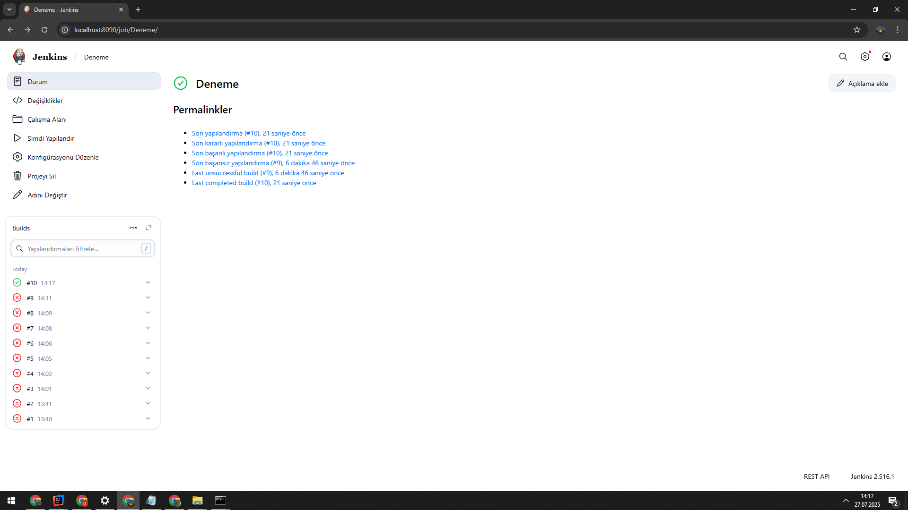

# TrivialApiForJenkins

A simple REST API that returns the message **"Merhaba API!"** (Hello API!).  
Designed to be a basic example for integrating with Jenkins automation pipelines.

---

## Project Overview

This project is a minimal API built for demonstration and learning purposes.  
It exposes a single endpoint that responds with the message **"Merhaba API!"**.  
The project is intended to be used with Jenkins to showcase automated testing and deployment.

---

## Features

- Simple REST API with a single GET endpoint  
- Easy to integrate with Jenkins pipelines  
- Maven-based project structure (if applicable)  

---


## Usage

Run the API server and send a GET request to the endpoint (e.g., `/hello`) to receive the greeting message.

Example response:
```json
{
  "message": "Merhaba API!"
}
```
## Project Preview
Below are some visuals demonstrating the API output and Jenkins configuration:

When the API is called via browser or HTTP client, it simply returns:





---


